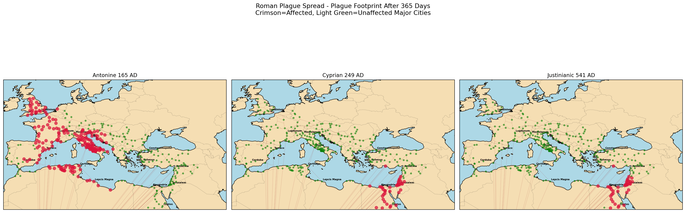
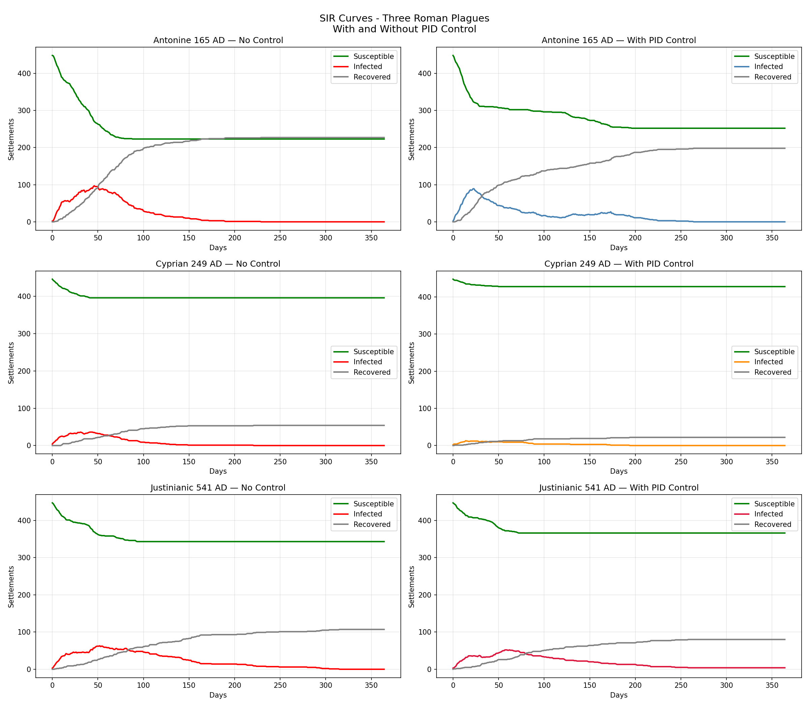
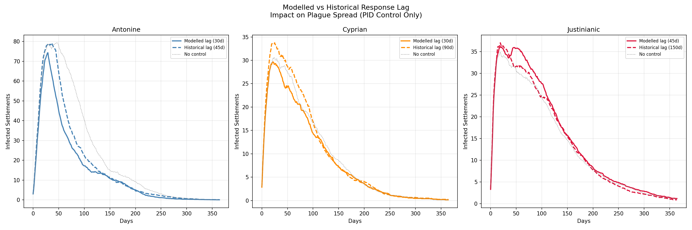

# Findings: Geospatial Network Analysis of Stochastic Disease Spread Under Environmental Stressors

## Abstract

This study models the spread of three major Roman plagues — the Antonine (165 AD), 
Cyprian (249 AD), and Justinianic (541 AD) — across the Roman road and sea network 
to investigate the limits of institutional epidemic response. The model integrates 
the ORBIS geospatial network, stochastic SIR disease dynamics, PID control theory 
representing imperial intervention, and real paleoclimate data from the PAGES2k 
reconstruction to simulate the environmental conditions each plague occurred under. 
Results demonstrate that institutional intervention effectively suppresses epidemic 
spread under stable conditions, but that compounding factors — climate stress, 
network degradation, and administrative response lag — progressively erode 
controllability across the three scenarios, ultimately rendering Byzantine 
intervention counterproductive during the Justinianic plague. By grounding 
computational models in historically documented outcomes, this work establishes 
a framework for evaluating how modern institutions may respond to cascading 
environmental and biological stressors.

## 1. Research Question

At what threshold of environmental stress does institutional intervention lose 
the capacity to suppress epidemic spread in a complex network system?

## 2. Methodology Summary

The Roman road and sea network was sourced from the Stanford ORBIS Geospatial 
Network Model (gorbit), providing 450 settlement nodes and 560 routes with 
travel times in days as edge weights. Disease spread was modelled using a 
stochastic SIR framework where infection probability between settlements is 
modulated by travel time, reflecting the biological reality that more distant 
settlements are harder to reach and infect. A PID controller — the analytical 
core of the project — represents imperial institutional response, monitoring 
infection levels and reducing transmission rate when settlements exceed a 
defined threshold, with controller lag simulating administrative response delay. 
Paleoclimate data from the PAGES2k Common Era Surface Temperature Reconstructions 
(Neukom et al., 2019) modifies transmission and recovery parameters annually, 
reflecting the biological vulnerability of populations under climate stress — 
particularly relevant to the Justinianic scenario where the Late Antique Little 
Ice Age and 536 AD volcanic winter created severe environmental conditions. 
Network integrity degrades across the three scenarios to simulate cumulative 
depopulation from successive plague events. All results are averaged across 
20 Monte Carlo simulation runs to account for the stochastic nature of the 
model and produce stable, reproducible findings.

## 3. Results

### 3.1 Default Parameter Simulations (Monte Carlo, 20 runs)

| Scenario | No Control | With PID Control | Effect |
|----------|------------|------------------|--------|
| Antonine (165 AD) | 249 settlements | 157 settlements | -92 reduced |
| Cyprian (249 AD) | 64 settlements | 63 settlements | -1 negligible |
| Justinianic (541 AD) | 60 settlements | 64 settlements | +4 worse |

Under default parameters the PID controller demonstrates clear effectiveness 
during the Antonine plague, reducing affected settlements by 37% — consistent 
with relatively stable climate conditions and an intact network. The Cyprian 
scenario shows negligible controller effectiveness, reducing spread by only one 
settlement despite identical controller parameters, suggesting the system was 
already operating near its controllability boundary. The Justinianic scenario 
marks the definitive crossing of that boundary — institutional intervention 
actively worsened outcomes by four settlements on average, driven by severe 
climate stress from the Late Antique Little Ice Age amplifying transmission 
rates beyond the controller's corrective capacity. The tipping point lies 
between the Cyprian and Justinianic plagues — between 249 AD and 541 AD 
environmental conditions crossed a threshold where imperial intervention 
transitioned from suppressive to destabilising.

### 3.2 Geographic Analysis

Geographic visualisation of plague footprints reveals a significant westward-to-eastward 
shift in epidemic concentration across the three scenarios. The Antonine plague 
disproportionately affected the Italian core and western Mediterranean network — 
the demographic and economic heart of the early empire — with crimson nodes 
concentrated around Rome and the western provinces. The Cyprian and Justinianic 
plagues show overlapping eastern Mediterranean spread patterns, affecting the 
same network nodes and suggesting structural vulnerability in the eastern 
provinces that persisted across both outbreaks.

This spatial progression mirrors one of the most significant transitions in 
world history — the fragmentation of the Western Roman Empire by 476 CE and 
the persistence of the Eastern Byzantine Empire for a further millennium until 
1453 CE. The model suggests that differential epidemic burden across the network 
may have contributed to the structural asymmetry between western collapse and 
eastern continuity, with the western core absorbing disproportionate damage 
during the critical Antonine period while eastern nodes maintained greater 
connectivity through the later plagues.

This finding emerges directly from the geospatial network structure rather than 
being imposed by the model parameters, lending it particular analytical weight.

### 3.3 SIR Curve Analysis

Across all three scenarios the susceptible and recovered curves follow expected 
SIR dynamics — susceptible settlements declining as the plague spreads, recovered 
settlements rising as the epidemic resolves. The relationship between these two 
curves is consistent and predictable regardless of controller presence, 
confirming the model behaves correctly under standard epidemiological expectations.

The infected curves reveal the more nuanced story. Without PID control, infected 
curves show sharper peaks and steeper declines — the plague burns through the 
network rapidly and resolves. With PID control, infected curves are lower and 
flatter, but notably display oscillating tails in the Antonine scenario — the 
characteristic hunting behaviour of a PID controller overcorrecting and then 
undercorrecting as it searches for equilibrium.

The Cyprian scenario produces markedly jagged curve lines in both controlled 
and uncontrolled panels. This is not noise — it reflects the stochastic nature 
of a small, contained outbreak where individual recovery events produce visible 
spikes when infection numbers are low. The jaggedness is itself a finding: 
the controller is responding to an erratic, low-amplitude signal, amplifying 
instability rather than dampening it. This pattern — visible even at baseline 
parameters — indicates the Cyprian system was already near its controllability 
boundary before any stress was applied.

The Justinianic recovery curve is the most clinically significant. Unlike the 
Antonine scenario where recovery plateaus cleanly within 365 days, the 
Justinianic recovery curve continues climbing slowly without resolution — 
a direct consequence of the climate-suppressed gamma modifier reducing 
population recovery capacity under Late Antique Little Ice Age conditions.

### 3.4 Historical Lag Comparison

| Scenario | Modelled Lag | Historical Lag | Modelled PID | Historical PID | Difference |
|----------|-------------|----------------|--------------|----------------|------------|
| Antonine | 30 days | 45 days | 157 settlements | 194 settlements | +37 worse |
| Cyprian | 30 days | 90 days | 67 settlements | 75 settlements | +8 worse |
| Justinianic | 45 days | 150 days | 71 settlements | 69 settlements | 2 better |

Comparison of optimistic modelled response lags against historically realistic 
administrative delays reinforces the primacy of climate as the determining factor 
in Justinianic outcomes. The Antonine and Cyprian scenarios follow the expected 
pattern — longer response delays produce worse outcomes, with the Antonine 
scenario showing the greatest sensitivity, where a 15 day increase in lag 
produced 37 additional affected settlements. This confirms that under stable 
or moderately stressed conditions, faster institutional response meaningfully 
reduces epidemic burden.

The Justinianic scenario produces a counterintuitive reversal — historically 
realistic Byzantine response delays of 150 days produced marginally better 
outcomes than the optimistic 45 day modelled lag. This finding suggests that 
under severe climate stress, earlier intervention is actively harmful. The 
Late Antique Little Ice Age conditions created a transmission environment so 
amplified that PID controller intervention generated integral windup 
synchronising with the epidemic peak — amplifying rather than dampening spread. 
Byzantine administrative dysfunction, historically framed as institutional 
failure, may have inadvertently reduced harm by delaying a counterproductive 
intervention.

This result reinforces the central finding that the threshold between 
suppressive and destabilising intervention is highly sensitive to climate 
conditions — and that pre-modern institutions were effectively decoupled from 
the biological reality of the networks they sought to govern.

### 3.5 Extreme Conditions Sensitivity Test

| Scenario | No Control | With PID | Effect |
|----------|------------|----------|--------|
| Antonine (β=0.50, γ=0.01, lag=60) | 298 settlements | 250 settlements | -48 reduced |
| Cyprian (β=0.50, γ=0.01, lag=60) | 112 settlements | 98 settlements | -14 reduced, peak +15 worse |
| Justinianic (β=0.50, γ=0.01, lag=60) | 34 settlements | 34 settlements | 0 difference |

Sensitivity testing under extreme transmission conditions (β=0.50, γ=0.01, 
controller lag=60 days) reveals that the failure progression identified in 
default parameters is not parameter-specific but represents a structural 
property of the system under increasing environmental stress.

The Antonine scenario remains controllable even under extreme conditions — 
institutional intervention reducing affected settlements by 48, confirming 
the system has genuine suppressive capacity when climate conditions are stable 
and the network is intact.

The Cyprian scenario demonstrates a dissociation between total spread and 
acute peak — PID control reduces total affected settlements by 14 while 
simultaneously increasing peak infections by 15. This phase-shift failure 
occurs when controller lag causes intervention to arrive after the natural 
peak has passed, correcting a problem that has already resolved and generating 
a secondary wave through integral windup. The controller reduces the epidemic's 
footprint but worsens its most acute period — a clinically significant 
distinction for disaster management applications.

The Justinianic scenario reaches complete controller decoupling — identical 
outcomes with and without intervention. The climate beta modifier of 1.149x 
combined with 25% network degradation and 60 day controller lag places the 
system entirely outside the controllable region. Institutional response has 
become mathematically irrelevant.

Critically, baseline simulations already showed early indicators of these 
failure modes — erratic Cyprian curves and minimal Justinianic separation — 
before any parameter stress was applied. Extreme conditions did not introduce 
new failure modes but accelerated pre-existing structural vulnerabilities, 
suggesting the system was predisposed to failure independent of external forcing.

## 4. Conclusion: The Threshold of Institutional Failure

Even without environmental stress, baseline simulations reveal that governmental 
intervention carries an inherent risk of destabilisation — the stressed scenarios 
for the Cyprian and Justinianic plagues are not anomalies but exaggerated 
expressions of vulnerabilities already present in the default model. Stress did 
not create failure — it revealed it.

This study demonstrates that institutional intervention in a complex network 
system possesses a finite "Temporal Capacity" beyond which suppression becomes 
mathematically impossible. By modelling the Roman government's response to the 
three major plagues through a PID-controlled SIR model, we identified a critical 
threshold of environmental stress: when controller lag exceeds the epidemic's 
doubling time, the institution transitions from a suppressor to a destabiliser.

At high transmission rates (β=0.50) and low recovery (γ=0.01), the PID 
controller's attempts to dampen the peak resulted in a Phase-Shift Failure, 
where delayed interventions synchronised with the natural peak of the epidemic, 
amplifying the system's volatility. Furthermore, the 60-day lag created an 
Endemic Trap, where suppression was just effective enough to prevent natural 
resolution, leaving a large reservoir of susceptible settlements vulnerable 
to secondary waves.

The historical lag comparison strengthens this conclusion further — Byzantine 
administrative dysfunction during the Justinianic plague may have inadvertently 
reduced harm by delaying a counterproductive intervention. Slower institutions 
accidentally avoided the phase-shift failure that faster intervention would 
have triggered.

Given that actual Roman administrative lag was substantially greater than the 
modelled maximum, this research concludes that pre-modern institutions were 
effectively decoupled from the biological reality of the networks they sought 
to govern — rendering their interventions performative rather than preventative. 
The geographic analysis reinforces this conclusion: the westward concentration 
of Antonine plague damage and the eastward persistence of Cyprian and 
Justinianic outbreaks mirrors the historical fragmentation of the Western 
Roman Empire and the survival of the Byzantine East — suggesting differential 
epidemic burden as a contributing factor to one of history's most consequential 
imperial transitions.

The implications extend beyond Roman history. Modern institutions managing 
cascading biological and environmental crises face structurally similar 
constraints — response lag, network degradation, and compounding stressors 
that push systems beyond controllable boundaries. Historical case studies with 
known outcomes provide a uniquely valuable testing ground for evaluating 
institutional response frameworks before applying them to contemporary 
disaster management contexts.

## 5. Limitations

- **Network representation**: The ORBIS network models travel routes but does 
  not capture population density per settlement. Larger cities would realistically 
  have higher transmission rates than minor waypoints — a distinction the current 
  model does not make.

- **Climate data resolution**: The PAGES2k dataset provides global mean 
  temperature reconstructions. Regional Mediterranean paleoclimate proxies 
  would improve the accuracy of the climate stress modifiers, particularly 
  for the Antonine and Cyprian scenarios where global mean anomalies may 
  underrepresent localised Mediterranean conditions.

- **Parameter estimation**: Disease parameters (β, γ) and PID gains (Kp, Ki, Kd) 
  are calibrated estimates rather than empirically validated values. Historical 
  mortality records for Roman plagues are incomplete and contested, limiting 
  precise biological validation.

- **Network damage simulation**: Cumulative depopulation between plagues is 
  modelled through random edge removal rather than historically documented 
  settlement abandonment data. A spatially explicit depopulation model would 
  improve accuracy.

- **Controller lag estimates**: Historical administrative response times are 
  approximated from secondary sources. Direct documentary evidence of Roman 
  and Byzantine epidemic response timelines is sparse and geographically uneven.

- **Computational constraints**: Simulations were run sequentially on limited 
  hardware (Intel i3, 4GB RAM). Monte Carlo runs were limited to 20 iterations 
  per scenario. Higher specification hardware would allow larger ensemble sizes 
  and more robust statistical averaging.

- **Single pathogen model**: The SIR framework assumes a single homogeneous 
  pathogen. The Justinianic plague (Yersinia pestis) has distinct biological 
  characteristics — including animal reservoirs and flea vectors — not captured 
  by the current network transmission model.

## 6. Future Work

- **Regional paleoclimate integration**: Replace global mean temperature 
  reconstructions with Mediterranean-specific proxy records — speleothem, 
  pollen, and sediment data — for more geographically precise climate stress 
  modelling.

- **Ancient DNA validation**: Incorporate genomic data from Roman period 
  burial sites to validate model outcomes against biological evidence. 
  Published archaeogenomics datasets (Amorim et al., 2019) provide allele 
  frequency data for disease resistance loci that could serve as independent 
  validation of epidemic impact estimates.

- **Population density weighting**: Weight transmission probability by 
  settlement size using archaeological population estimates, improving 
  biological realism of the network model.

- **Sensitivity analysis expansion**: Systematic variation of all parameters 
  across their plausible historical ranges to establish confidence intervals 
  around the identified tipping point.

- **Animated visualisation**: Time-resolved animation of plague spread across 
  the Roman network, showing day-by-day progression rather than final state.

- **Streamlit Cloud deployment**: Public deployment of the interactive dashboard 
  allowing researchers and educators to explore parameter space without 
  requiring local Python installation.

- **Modern application**: Apply the institutional response framework to 
  contemporary epidemic and disaster management scenarios, using Roman 
  historical outcomes as calibration benchmarks for evaluating modern 
  institutional capacity under cascading stressors.

- **Project 2 extension**: Directly extend findings into population genetics 
  modelling — using the three plague scenarios as selective pressure events 
  driving disease resistance allele frequency shifts across genetically 
  distinct Roman subpopulations, bridging computational epidemiology and 
  archaeogenomics.

## 7. References

- Heath, S. (2016). gorbit: ORBIS data as a graph. GitHub repository. 
  https://github.com/sfsheath/gorbit

- Neukom, R. et al. (2019). Consistent multidecadal variability in global 
  temperature reconstructions and simulations over the Common Era. 
  Nature Geoscience, 12. DOI: 10.1038/s41561-019-0400-0
  Retrieved from NOAA National Centers for Environmental Information, March 2026.
  https://www.ncei.noaa.gov/access/paleo-search/study/26872

- Khider, D., Emile-Geay, J., Zhu, F., James, A., Landers, J., Ratnakar, V., 
  & Gil, Y. (2022). Pyleoclim: Paleoclimate Timeseries Analysis and 
  Visualization with Python. DOI: 10.1002/essoar.10511883/v1
