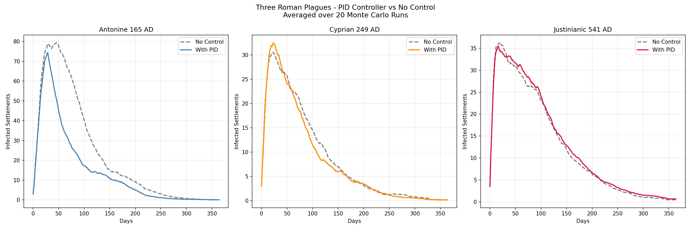

# Geospatial Network Analysis of Stochastic Disease Spread Under Environmental Stressors

## Research Question
At what threshold of environmental stress does institutional intervention lose 
the capacity to suppress epidemic spread in a complex network system?

## Overview
This project models the spread of three Roman plagues across the Roman road 
and sea network using SIR epidemiological modelling, PID control theory, and 
real paleoclimate data. The three plagues serve as a natural experiment:

- **Antonine Plague (165 AD)** — control condition, stable climate
- **Cyprian Plague (249 AD)** — moderate environmental stress
- **Justinianic Plague (541 AD)** — severe climate stress, Late Antique Little Ice Age

## Key Finding
Monte Carlo averaged results (20 runs per scenario) reveal a clear progression
in controller effectiveness as environmental stress increases:

| Scenario | No Control | With PID Control | Effect |
|----------|------------|------------------|--------|
| Antonine (165 AD) | 249 settlements | 157 settlements | -92 reduced |
| Cyprian (249 AD) | 64 settlements | 63 settlements | -1 negligible |
| Justinianic (541 AD) | 60 settlements | 64 settlements | +4 worse |

The tipping point lies between the Cyprian and Justinianic plagues. By 541 AD,
severe climate stress from the 536 AD volcanic winter had pushed the system 
beyond the controller's capacity to suppress outbreak spread. Imperial 
intervention became not only ineffective but counterproductive.

## Methodology

### Network
Roman road and sea network from the ORBIS Stanford Geospatial Model (gorbit).
450 settlements, 560 routes. Network integrity degrades across the three 
scenarios to simulate cumulative depopulation from previous plagues.

### Disease Model
Stochastic SIR (Susceptible-Infected-Recovered) model where infection 
probability between settlements is modulated by travel time in days. 
Beta (transmission rate) and gamma (recovery rate) are tuned per scenario 
to reflect each plague's known characteristics.

### Control Theory
PID controller simulating imperial response — monitoring infection levels 
and reducing transmission rate when infections exceed a setpoint. Controller 
lag simulates bureaucratic response delay. The same controller parameters 
are applied across all three scenarios to isolate environmental stress as 
the variable driving outcomes.

### Paleoclimate Integration
Temperature anomaly data from the PAGES2k Common Era Surface Temperature 
Reconstructions (Neukom et al., 2019) modifies beta and gamma parameters 
annually. Colder years increase transmission rate and reduce recovery capacity,
reflecting the biological vulnerability of malnourished populations.

## Data Sources
- **ORBIS Roman Network**: Stanford University Geospatial Network Model
- **Paleoclimate Data**: PAGES2k Common Era Surface Temperature Reconstructions,
  Neukom et al. (2019), Nature Geoscience. 
  DOI: 10.1038/s41561-019-0400-0
  Retrieved from NOAA National Centers for Environmental Information.

## Project Structure
```
roman_plague_model/
├── data/               — Network and climate datasets
├── models/             — Reusable SIR and PID components  
├── scenarios/          — Three plague simulations
│   ├── antonine.py
│   ├── cyprian.py
│   └── justinianic.py
├── visualisation/      — Map and curve outputs
├── outputs/            — Generated figures and results
├── docs/               — Research notes and references
├── climate_model.py    — Paleoclimate data integration
└── main.py             — Runs all scenarios and comparison
```

## Requirements
See `requirements.txt`. Install with:
```bash
pip install -r requirements.txt
```

## How to Run
```bash
# Activate virtual environment
source venv/bin/activate
# Pull the data and compile
python prepare_climate.py
# Run full comparison
python main.py

# Run individual scenarios
python scenarios/antonine.py
python scenarios/cyprian.py
python scenarios/justinianic.py
```

## Results


## Limitations
- Network damage between plagues is simulated by random edge removal rather 
  than historically documented depopulation data
- Climate stress modifiers are calibrated estimates rather than empirically 
  validated biological parameters
- The PAGES2k dataset provides global mean temperature — Mediterranean regional
  data would improve accuracy
- Controller parameters are not historically validated against documented 
  imperial response measures

## Future Work
- Integrate regional Mediterranean paleoclimate proxies
- Add genomic data from ancient Roman burial sites for biological validation
- Implement Streamlit dashboard for interactive parameter exploration
- Extend to model economic network disruption alongside disease spread

## Citation
If using this project please cite the PAGES2k dataset:
Neukom, R. et al. (2019). Consistent multidecadal variability in global 
temperature reconstructions and simulations over the Common Era. 
Nature Geoscience, 12. DOI: 10.1038/s41561-019-0400-0

Khider, Deborah & Emile‐Geay, Julien & Zhu, Feng & James, Alexander & Landers, Jordan & Ratnakar, Varun & Gil, Yolanda. (2022). Pyleoclim: Paleoclimate Timeseries Analysis and Visualization With Python. Paleoceanography and Paleoclimatology. 37. 10.1029/2022PA004509. 